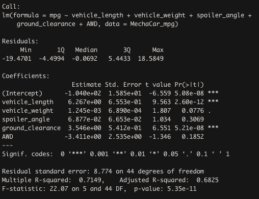
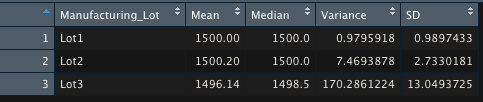
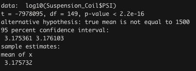
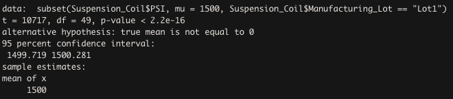
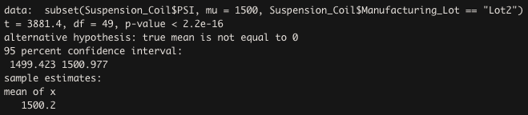
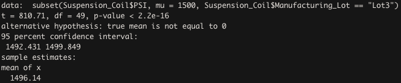

# MechaCar_Statistical_Analysis

## Linear Regression to Predict MPG
The coefficients that provided a non-random amount of variance to the mpg values are vehicle_length, vehicle_weight, spoiler_angle, ground_clearance and AWD. In addition, the p-value of our linear regression analysis is 5.35x10^-11, which is significantly smaller than the assumed significance level of 0.05%. Therefore, we can state there is sufficient evidence to reject the null hypothesis and consider our slope to not be zero. Our R squared is valued at 0.71, which means 71% of all the miles per gallon predictions will be correct. 

## Summary Statistics on Suspension Coils
  MechaCar suspension coils dectate that the variance of the coils must not exceed 100 pounds per square inch. This specification does comply with the variance of all manufacturing lots. In our total_summary dataframe, it shows that the variance of all lots is 62.29 pounds per square inch. Which is less than the 100 pounds per square inch that MechaCar would not like to exceed. However, our lot_summary indicates that Lot 3 has a variance that significantly higher than Lot 1 and 2. Lot 3 shows that it has a variance of 170.29 pounds per square inch, which exceeds the 100 pounds per square inch limitation.
  
  
  
  
  
## T-Tests on Suspension Coils
  While conducting a one sample t-test that determines if the PSI across all manufacturing lots is statistically different from the population mean of 1,500. It can be concluded that, the PSI across all manufacturing is not statistically significant because the p-value is 2.2x10^-16, which is less than 0.05%. Therefore, we can state that there is sufficient evidence to reject the null hypothesis. Interesting, the following t-tests also have a p-value of 2.2x10^-16 but each t-test has a different mean. 

  
## Study Design: MechaCar vs Competition
  The AutoRUs’ prototype “The MechaCar” can be apart of a statistical study that determines the MechaCar against its competitors. Using metrics much as MPG, horsepower, model classification, safety rating, cost, specifications, maintenance cost, and drivetrain. Performing a linear regression model to compare the MechaCar metrics with its competitors. With this model, the null hypothesis would be if the MechaCar is statistically different from its competitors and the alternative hypothesis would be if the MechaCar isn’t statistically different from it’s competitors. The data from the metrics will be needed in order to conduct a proper statistical test. The information contained from this test would help AutoRUs’ to determine if their prototype will be successful or a failure. 
